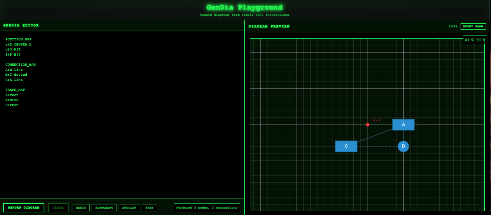

# GenDia

A simple rule based diagram generation tool that creates visual diagrams.

## Preview


## Features

- **Grid-Based Coordinate System**: 20px grid with visual alignment and coordinate display
- **Arrow Support**: Single arrows (`arrow`) and double arrows (`doublearrow`)
- **Contour-Based Connections**: Lines connect to shape boundaries, not centers
- **Real-time Preview**: Live diagram rendering as you type
- **File-Based Examples**: Dynamic example loading from `.gendia` files

## Overview

GenDia uses a custom `.gendia` file format to define diagrams through three sections:
- **POSITION_MAP**: Node positions using relative positioning grammar
- **CONNECTION_MAP**: Node connections with line styles and arrows
- **SHAPE_MAP**: Node shapes (rect, circ, diamond)

## File Format

```gendia
POSITION_MAP
r{8}CENTER|A
d{5}A|B
l{5}B|C

CONNECTION_MAP
A:B|arrow
B:C|dotted
C:A|line

SHAPE_MAP
A:rect
B:circ
C:rect
```

## Positioning Grammar

- **Directional**: `l|r|u|d{distance}knownNode|newNode`
  - `l` = left, `r` = right, `u` = up, `d` = down
  - Distance in grid units (1 unit = 20px grid square)
- **Angular**: `{angle}deg{distance}knownNode|newNode`
  - Angle in degrees (0-360), distance in grid units
- **CENTER** is the required starting reference point at (0,0)

## Connection Types

- `line`: Solid line connection
- `dotted`: Dotted line connection
- `arrow`: Single-headed arrow
- `doublearrow`: Double-headed arrow

## Shape Types

- `rect`: Rectangle
- `circ`: Circle
- `diamond`: Diamond shape
